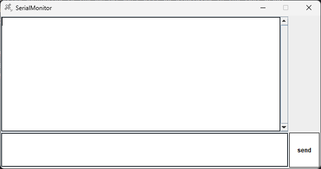

# Simple Serial Monitor

## Overview
This program is a simple serial monitor written in Java.
It can communicate with devices connected to the serial port.

## Requirements
- Java 11 or higher
- jSerialComm library

## Usage
1. Run the program and a GUI window will appear.
2. The data sent from the device connected to the serial port will be displayed in the text area.
3. To send data, enter it in the text field below the text area and press Enter key or click the Send button.
4. To terminate the connection, click the Disconnect button.

## Disclaimer
- This program is created for learning purposes and does not guarantee complete functionality or safety.
- The author is not responsible for any damage caused by using this program.
- This program can be modified and redistributed freely, but please keep the copyright notice and license terms.